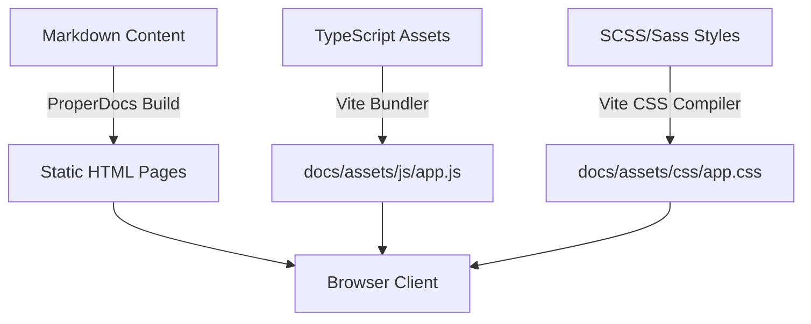

<!--
Copyright ©2026 Michael R. Bernstein. Licensed under CC-BY 4.0.
See root README.md for global project-wide upstream attributions.
-->

# Colophon

This colophon describes the current technology stack, typography, aesthetics, and deployment pipelines of **WGSL: A Primer**. For full project lineage, authorship attribution, and copyright details, see the [Copyright & License](copyright.md) page.

---

## Technology Stack

WGSL: A Primer is compiled, bundled, and rendered using a modern, lightweight, and standard-compliant technical architecture:

### Static Site Generation

- **Static Site Engine**: [ProperDocs](https://github.com/properdocs/properdocs) generates the static pages.
- **Theme and Formatting**: Powered by [MaterialX](https://github.com/properdocs/mkdocs-materialx), providing a customizable, responsive layout with built-in dark/light mode toggles.

### Bundling & Compilation

- **Asset Bundle Compiler**: [Vite](https://vite.dev/) compiles, transpiles, and bundles the interactive TypeScript modules and Sass styles into high-performance, minified static files within `docs/assets/`.
- **Sass Stylesheets**: Custom visual styling is authored in modular SCSS, with CSS custom variables matching the Material design system.

### Interactive Experiences

- **Live Code Editing**: Integrated using [CodeMirror 6](https://codemirror.net/) with specific syntax highlighting provided by `@iizukak/codemirror-lang-wgsl`.
- **GPU Interactive Visualizers**: Authors custom, responsive visualizer modules (`ArrayVisualizer` and `WorkgroupVisualizer`) to demonstrate complex GPGPU execution paradigms, including structure alignments, workgroup execution timelines, barrier stalls, and atomic coordination.
- **WebGPU Backing**: Leveraging real-time WebGPU pipelines when supported by the client browser, with seamless vector-graphic (SVG) and HTML fallback animations on incompatible hardware.

### Mathematics & Processing

- **Mathematical Typesetting**: Rendered beautifully at 60 FPS using [MathJax v3](https://www.mathjax.org/) via the `pymdownx.arithmatex` extension, allowing clear LaTeX-style mathematical annotations for alignment calculations.

---

## Typography & Aesthetics

- **Body Typeface**: Utilizing Google Fonts' **Inter** or **Roboto** (via the MaterialX design tokens), which provides exceptional legibility, balanced geometric structures, and clean tracking optimized for highly technical, dense software engineering documentation.
- **Code Styling**: Monospaced font families (such as **Fira Code**, **JetBrains Mono**, or **Roboto Mono** depending on local system availability) are bound to `var(--md-code-font-family)`. This is paired with custom syntax coloring designed to distinguish GPU primitives, control-flow statements, math operations, and shader built-ins clearly.
- **Syntax Templates & Signatures**: Leverages custom HTML `<code>` templates alongside specialized CSS class spans (such as `.template-array-t`) to render non-concrete signatures beautifully. Outside signatures, standalone parameter descriptions utilize the `.template` chips to maintain strict typographical distinction without layout shifts.
- **Mathematical Typesetting**: Leverages **MathJax v3** to render complex mathematical formulas in a dedicated high-quality TeX-style typeface. To maintain strict visual alignment with standard prose, inline math is enclosed within `\( ... \)` delimiters to ensure zero baseline-shift and prevent vertical line height disruption.
- **Adaptive Layout**: Implements a CSS-Grid-based dual-pane split on screens larger than `1200px`, allowing learners to read descriptive material on the left panel completely independently while keeping the interactive shader compiler workspace locked in-viewport on the right.
- **Themes & Design**: Uses coordinated teal palette tokens (`teal` for primary and accent) layered with glassmorphic transparency filters and CSS micro-animations to wow users with clean, fluid feedback states.

---

## Deployment & Delivery

The platform is automatically maintained and deployed via continuous integration:

- **Build Pipelines**: Managed via GitHub Actions workflows (`deploy-main.yml` and `build-pr.yml`).
- **Static Hosting**: Served at high speeds via [GitHub Pages](https://pages.github.com/).

