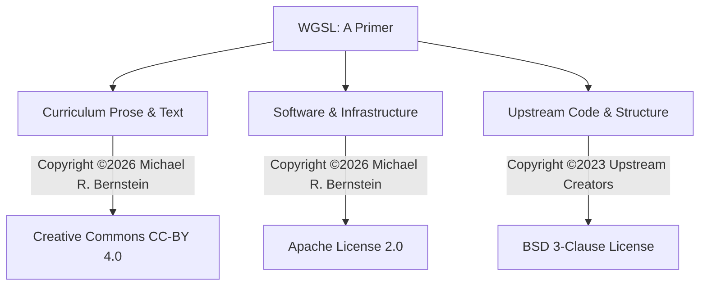

<!--
Copyright ©2026 Michael R. Bernstein. Licensed under CC-BY 4.0.
See root README.md for global project-wide upstream attributions.
-->

# Copyright & License

This document describes the copyright ownership, authorship, and licensing terms for **WGSL: A Primer**.

---

## Project Lineage & Authorship

**WGSL: A Primer** is a modernized, rewritten, and expanded fork of the archived original 2023 [*Tour of WGSL*](https://google.github.io/tour-of-wgsl/).

### Contributors & Maintainers

* **Michael R. Bernstein (Active)**: Modern fork author and primary maintainer. Developer of the modern fixed-size/runtime array layouts, workgroup/subgroup timeline visualizers, bitwise operator lessons, uniformity analysis cases, and static linters.
* **Original Upstream Creators ([Upstream](#3-upstream-code-structure-bsd-3-clause))**: Authors of the foundational 2023 content structure, core visualizer backing systems, and original WebGPU simulation engines:
  - **Ben Clayton** ([@ben-clayton](https://github.com/ben-clayton)) — Core upstream developer, Tint/compiler architect.
  - **Dan Sinclair** ([@dj2](https://github.com/dj2)) — Upstream author, former WGSL specification editor, and key curriculum contributor.
  - **David Neto** ([@dneto0](https://github.com/dneto0)) — Tint team lead, compiler engineer, and WGSL specification editor.

### Third-Party Assets & Logos

* **WebGPU / WGSL Logo**: The official WebGPU/WGSL logo utilized on this site (under `docs/images/logo.svg` and `docs/images/webgpu-white.svg`) was created by Brandon Jones in 2021 and is maintained by the **World Wide Web Consortium (W3C)**.
  - **Licensing**: Licensed under the **Creative Commons Attribution 4.0 International (CC-BY 4.0)** license.
  - **Attribution**: "WebGPU logo by W3C"

---

## Licensing Architecture

To support open education while respecting both original upstream authors and modern advancements, **WGSL: A Primer** uses a multi-tiered licensing structure:

---

## 1. Curriculum Content & Prose (CC-BY 4.0)

All lessons, guides, explanations, diagrams, mathematical formulas, and tutorial text added or modified in 2026 are:

**Copyright &copy; 2026 Michael R. Bernstein.**

Licensed under the **Creative Commons Attribution 4.0 International (CC-BY 4.0)** license.

### CC-BY 4.0 Summary

You are free to:

* **Share** — copy and redistribute the material in any medium or format.
* **Adapt** — remix, transform, and build upon the material for any purpose, even commercially.

Under the following terms:

* **Attribution** — You must give appropriate credit, provide a link to the license, and indicate if changes were made. You may do so in any reasonable manner, but not in any way that suggests the licensor endorses you or your use.

The full license terms are available in the root file [LICENSE-TEXT](https://github.com/webmaven/tour-of-wgsl/blob/main/LICENSE-TEXT).

---

## 2. Software & Infrastructure (Apache 2.0)

All site configurations, python build hooks, build utilities, newly created interactive TypeScript visualizer modules, and custom stylesheets added or modified in 2026 are:

**Copyright &copy; 2026 Michael R. Bernstein.**

Licensed under the **Apache License, Version 2.0** (the "License").

### Apache 2.0 Summary

You are free to:

* **Use** — run, test, and execute the software for any purpose, including commercial applications.
* **Modify & Distribute** — change, copy, and distribute the code under Apache 2.0 terms.
* **Patent Grant** — receive a royalty-free, perpetual patent license granted by the contributors.

Under the following terms:

* **Attribution** — You must include a copy of the license, retain copyright and trademark notices, and clearly state if you made changes to the files.
* **Warranty & Liability** — All software is provided "as is," without any warranty or liability of any kind.

You may not use these files except in compliance with the License. You may obtain a copy of the License at:
http://www.apache.org/licenses/LICENSE-2.0

Unless required by applicable law or agreed to in writing, software distributed under the License is distributed on an "AS IS" BASIS, WITHOUT WARRANTIES OR CONDITIONS OF ANY KIND, either express or implied. See the License for the specific language governing permissions and limitations under the License.

The full license terms are available in the root file [LICENSE-CODE](https://github.com/webmaven/tour-of-wgsl/blob/main/LICENSE-CODE).

---

## 3. Upstream Code & Structure (BSD 3-Clause)

The original 2023 files, curriculum structures, and core assets are Copyright &copy; 2023 and licensed under the **BSD 3-Clause License** (preserved in the root [LICENSE-UPSTREAM](https://github.com/webmaven/tour-of-wgsl/blob/main/LICENSE-UPSTREAM) file).

Where files combine both upstream and modern work (derivative work), they are dual-licensed: modern 2026 contributions are licensed under Apache 2.0 (for code) or CC-BY 4.0 (for prose), while original 2023 BSD 3-Clause copyrights are preserved intact. Newly created or fully rewritten files are governed solely by the 2026 license terms.
