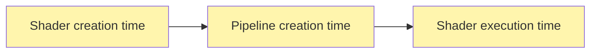
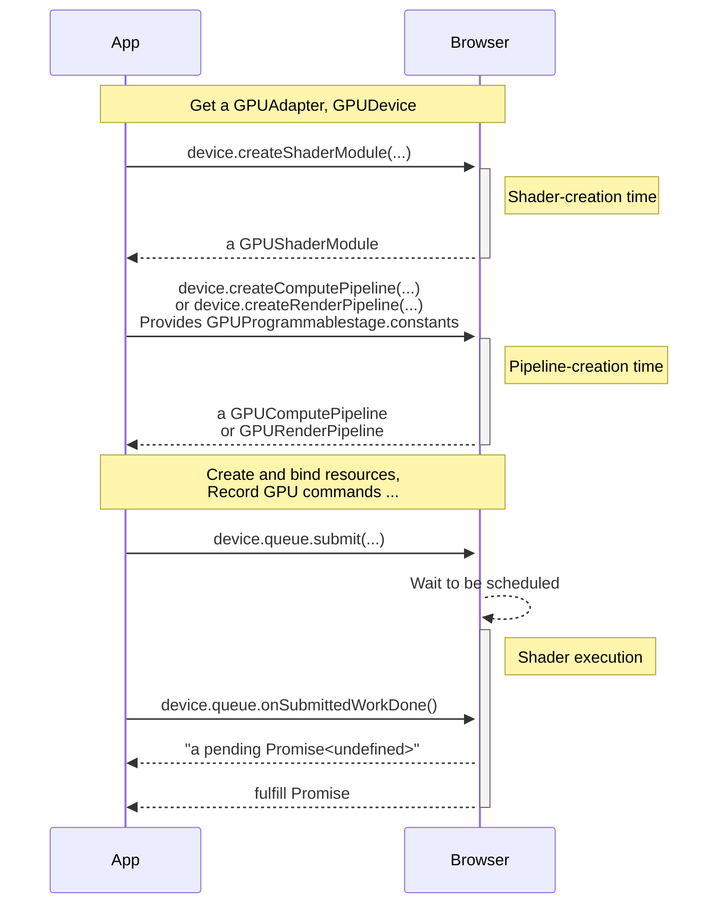

---
# Copyright ©2026 Michael R. Bernstein. Licensed under CC-BY 4.0.
# See root README.md for global project-wide upstream attributions.
title: 'Evaluation Stages Overview'
---
Value expressions in WGSL are classified according to the earliest phase in which they can be fully evaluated. To maximize performance and optimization, the WebGPU compilation pipeline evaluates expressions across three distinct **Evaluation Stages**, each occurring at a different point in a shader's lifetime.

By performing as much computation as possible on the CPU before the shader runs on the graphics hardware, WebGPU is able to generate highly optimized machine code specifically tailored to your hardware and execution parameters.

---

## The Three Stages at a Glance

The following table summarizes the three evaluation stages, when they occur in your application's WebGPU lifecycle, and the core language keywords associated with them:

| Evaluation Stage                        | WebGPU API Trigger                                                           | Expression Category   | Primary Keyword | Typical Contents / Sub-expressions                               |
| :-------------------------------------- | :--------------------------------------------------------------------------- | :-------------------- | :-------------- | :--------------------------------------------------------------- |
| **[Constant Stage](constant/index.md)** | `device.createShaderModule(...)`                                             | `const-expression`    | `const`         | Literals, other `const` values, compile-time built-in functions  |
| **[Override Stage](override/index.md)** | `device.createComputePipeline(...)`   `device.createRenderPipeline(...)` | `override-expression` | `override`      | Constants, `@id` overridable variables, and host-supplied values |
| **[Runtime Stage](runtime/index.md)**   | `device.queue.submit(...)`                                                   | `runtime-expression`  | `let`, `var`    | Function parameters, local variables, buffer reads, and GPU math |

---

## Constant Stage (Compile-Time)

The **Constant Stage** occurs when the browser compiles your WGSL shader source code into a GPU shader module.

- **Trigger**: `device.createShaderModule(...)`
- **Keyword**: `const`
- **Concept**: Expressions evaluated here are called **constant-expressions**. They can only be formed from literal values, other constant-declared values, and `@const` built-in functions.
- **Why it matters**: Evaluating math at compile-time on the CPU allows the compiler to optimize the resulting machine instructions (e.g., constant folding, dead-code elimination, and loop unrolling), saving precious GPU cycles.

---

## Override Stage (Pipeline-Creation)

The **Override Stage** occurs after shader module creation, when you configure and construct your render or compute pipelines.

- **Trigger**: `device.createComputePipeline(...)` or `device.createRenderPipeline(...)`
- **Keyword**: `override`
- **Concept**: **Override-expressions** are evaluated during pipeline creation. They can incorporate compile-time constants as well as pipeline-overridable constants whose values are specified by the CPU host application via WebGPU's `constants` API map.
- **Why it matters**: This allows you to specialize shaders (e.g., adjusting a local workgroup size or toggling a feature) dynamically at pipeline creation without having to re-compile or ship separate shader source files.

---

## Runtime Stage (Shader Execution)

The **Runtime Stage** is the final stage, occurring when the compiled shader is actually executed on the GPU cores.

- **Trigger**: `device.queue.submit(...)`
- **Keywords**: `let` and `var`
- **Concept**: **Runtime-expressions** are evaluated during shader execution. They can contain anything in an override-expression, plus function-local variables, function calls, buffer contents, reference/pointer values, and other dynamic parameters.
- **Why it matters**: This is the stage where the bulk of your shader's work takes place, running in parallel across millions of GPU threads.

---

## In Context

The evaluation phases fit into a WebGPU application's API lifecycle as follows:

<figure>

</figure>

---

## Stage Deep Dives

For detailed reference, syntax patterns, and interactive visualizers for each stage, refer to the following guides:

- **[Constant Stage](constant/index.md)**: Compile-time expressions, constant folding, and compile-time assertions.
- **[Override Stage](override/index.md)**: Pipeline-creatable expressions, CPU overrides, and dynamic sizing.
- **[Runtime Stage](runtime/index.md)**: GPU registers, parallel execution, and performance optimization.
