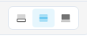
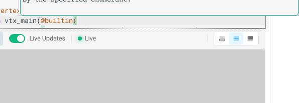

---
# Copyright ©2026 Michael R. Bernstein. All new modifications licensed under CC-BY 4.0.
# Upstream lineage ©2023 governed by original BSD 3-Clause. See README.md.
IsHome: true
title: "WGSL: A Primer"
shader: ./index.wgsl
visualizer: /ts/graphics_visualizer.ts
---

<!-- Force pages rebuild -->

# WGSL: A Primer

An introductory tour of the WebGPU Shader Language

## Welcome

Welcome to **WGSL: A Primer**—a condensed technical reference and interactive playground for the [WebGPU Shading Language](https://w3.org/TR/WGSL). Designed for developers with an interest in GPGPU (General-Purpose computing on GPUs), this resource assumes standard programming experience and serves as an entry point to a broader learning path.

This Primer focuses on how WebGPU's execution model maps directly to physical GPU hardware, explaining how its compilation constraints arise from that hardware design. Rather than viewing these constraints as obstacles, understanding and embracing them enables you to unlock maximum parallel performance directly inside the browser.

By bridging the gap between web development and hardware architectures, the primer empowers web and front-end developers to transition into GPGPU programming and unlock high-performance client-side web application development.

## Interactive Features

The primer provides the WGSL shaders for each example. The shaders can be
edited in the text view, with compiling output displayed immediately.

Interactive and editor capabilities include:

??? info "Compilation & Live Execution"
    Modifications are automatically compiled and executed within the graphics or compute pipeline. When you make changes, the status bar instantly reflects compilation states, while error diagnostics are rendered directly inline within the code editor.

    

??? tip "Interactive Workspace & Layouts"
    An integrated, premium status bar is docked directly to the base of the code editor. It features interactive controls to toggle responsive, split, or maximized layouts, giving you complete flexibility to maximize your code view or canvas area.

    

??? note "Canvas Animation Play/Pause"
    Hovering or tapping an active graphics shader canvas displays a glassmorphic overlay containing a play/pause button. This allows you to toggle execution, freeze rendering frames to inspect complex pixel behaviors, or save local CPU/GPU resources.

    

??? important "Keyboard Shortcuts & Definition Tooltips"
    Position the text cursor over attributes (e.g. `@builtin`), built-in values (e.g. `vertex_index`), or intrinsic functions (e.g. `sin`) and press `ctrl-o` to display inline documentation and type definitions. You can dismiss the tooltip by pressing `Escape` or clicking outside of it.

    Page-level keyboard shortcuts for Prev/Next navigation are automatically protected and bypassed when focus is inside the code editor to prevent accidental page switching.

    

Each of these shaders can serve as the starting point for your own
exploration.

!!! question "Warmup Activity"
    As a warmup, edit the `frag_main` function. First, uncomment the assignment on line 67 (which rotates the color values clockwise: `final_color = final_color.gbr;`). Then, instead, try uncommenting the assignment on line 69 (which rotates the color values counter-clockwise: `final_color = final_color.brg;`). What happens to the gradient's colors?

The primer is organized into the following sections:

- **[Functions](functions/index.md)**: Function syntax, calls, the `@must_use` attribute, and entry points.
- **[Types](types/index.md)**: Supported types in WGSL, from basic scalars and vectors to structures, pointers, and atomics.
- **[Expressions](expressions/index.md)**: Operators and different evaluation stages (constant, override, runtime).
- **[Variables & Constants](variables/index.md)**: Declaration and usage of mutable variables (`var`) and immutable values (`const`, `override`, `let`).
- **[Control Flow](control-flow/index.md)**: Branching and looping statements (`if`, `switch`, `loop`, `while`, `for`).
- **[Binding Points](binding-points/index.md)**: Connection of shaders to CPU-side resources like buffers and textures using binding points and attributes.
- **[Uniformity Analysis](uniformity-analysis/index.md)**: Compile-time execution uniformity tracking for derivative and barrier safety.

Each section has several sub-pages, and you can navigate forward
and backward using the buttons on the bottom of each page, or by using the
left and right keys on your keyboard.

