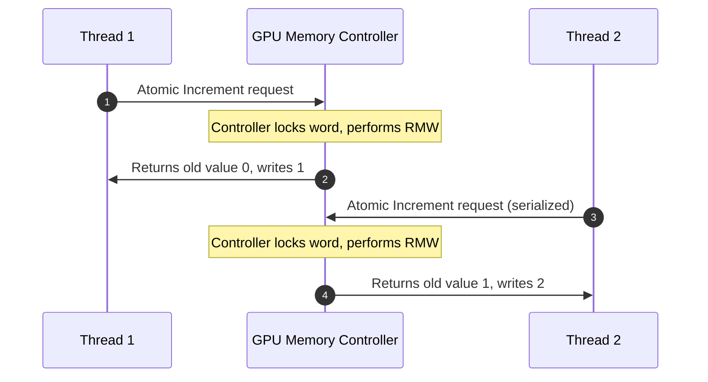

# The Coordination Problem

GPUs execute shaders with massive parallelism. Thousands of invocations (threads) run concurrently, executing code with overlapping, uncoordinated schedules.

Invocations often share variables in the `workgroup` and `storage` address spaces. Since both spaces allow reading and writing, overlapping threads accessing the same memory word will conflict if at least one of those accesses is a write. Without coordination, this results in a **data race**.

---

## The Anatomy of a Race Condition

Ordinarily, a read-modify-write cycle (such as incrementing a shared variable with `counter += 1`) is not a single operation. Under the hood, the hardware must perform three separate steps:

1. **Read**: Load the current value from memory into a local register.
2. **Modify**: Add `1` to the register value.
3. **Write**: Store the updated value back to memory.

When multiple threads perform this cycle concurrently without synchronization, their steps overlap, corrupting the shared data:

| Time | Thread A | Thread B | Shared Memory Value |
| :--- | :------- | :------- | :------------------ |
| 1    | Reads `0` | —        | `0`                 |
| 2    | —        | Reads `0` | `0`                 |
| 3    | Adds `1` | —        | `0`                 |
| 4    | Writes `1`| Adds `1` | `1` (Written by A)  |
| 5    | —        | Writes `1`| `1` (Overwritten!)  |

Instead of the correct sum of `2`, the final value is corrupted to `1`. This is a **data race**. In real applications, data races produce silent, untraceable data loss, rendering your simulation or computation unpredictable.

---

## Avoiding Data Races with Atomics

To solve this coordination problem, we need **Atomics**. 

An atomic operation guarantees that the entire Read-Modify-Write cycle is performed as a **single, indivisible hardware operation**. 

When multiple threads concurrently attempt an atomic operation on the same memory location, the GPU's memory controllers and ALU units enforce **Hardware Serialization**—executing the requests one after another. No updates are ever interleaved or lost:

In WGSL, to safely coordinate memory:

1. You must give shared variables an **`atomic` type**.
2. You must access those variables **exclusively** using **atomic built-in functions**.

---

## Live Race Simulation

The simulation on the right directly showcases the hazard of uncoordinated parallel writing versus the safety of atomic execution.

In this demonstration:

* **\(1000\) concurrent threads** attempt to increment a shared counter variable.
* **Ordinary Counter (`raced_sum`)**: Under the hood, the threads use a non-atomic read-modify-write cycle (`insecure_counter += 1u`). Because thread executions overlap in time, many increments collide, resulting in silent and significant data loss (yielding a final value far below \(1000\), e.g., \(642\)).
* **Atomic Counter (`atomic_sum`)**: The threads increment the counter using `atomicAdd(&secure_counter, 1u)`. The GPU hardware serializes all concurrent requests, ensuring no updates are interleaved or lost, resulting in the perfect total of \(1000\).

This live contrast shows why atomics are indispensable when writing concurrent GPU code.

---

!!! warning "Beware: Weak Ordering"
    Atomic hardware serialization is only guaranteed and consistent with respect to a **single memory location**. When comparing the orderings of operations across *different* memory locations, GPU threads execute under a **weakly-ordered memory model**. It may appear that causality is violated between variables unless you explicitly synchronize memory caches. 

    To coordinate visibility across multiple distinct variables, you must use **Memory Barriers**. Learn more in the [Barriers & Memory Synchronization](../../variables/memory-barriers.md) section.

