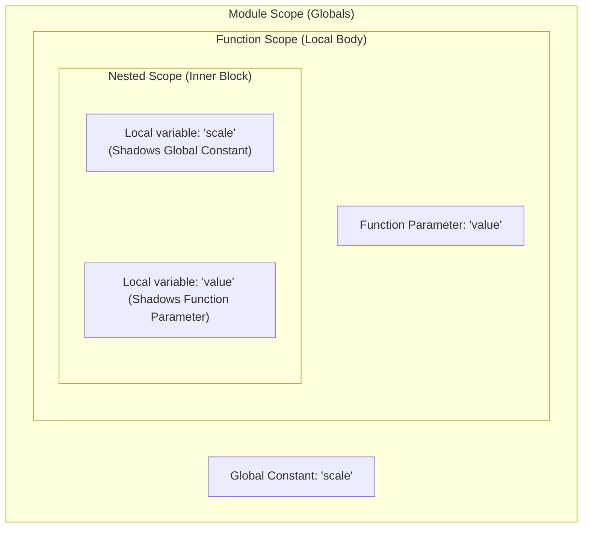

---
# Copyright ©2026 Michael R. Bernstein. Licensed under CC-BY 4.0.
# See root README.md for global project-wide upstream attributions.
title: "Name Shadowing"
---
**Name shadowing** occurs when an identifier (such as a variable, constant, or parameter) declared within a nested lexical scope shares the exact same name as an identifier in an outer scope. 

Under WGSL's scope resolution rules, references to that name resolve to the innermost declaration, effectively "shadowing" (hiding) the outer declaration for the duration of the nested block.

---

## Scoping & Resolution Rules

A name is only visible within the lexical block where it is declared, including any nested blocks. When name lookup occurs, the compiler searches from the innermost block outward to module-scope globals, then to built-in functions/types.

### Permitted Shadowing

A local function-scoped declaration (`var`, `let`, or `const`) is permitted to shadow:

*   **Module-Scope Globals**: Global constants, global variables, custom structure types, or functions.
*   **Outer Enclosing Blocks**: Any identifier declared in an outer enclosing nested lexical block.
*   **Language Built-ins**: WebGPU built-in types, built-in functions, or pre-declared keywords.

### Prohibited Re-declarations (Compile Errors)

The WGSL compiler enforces strict namespace safety, generating a compile-time error for the following re-declaration scenarios:

*   **Same-Scope Re-declaration**: Declaring two identifiers with the same name within the *exact same* block is a compile-time error.
*   **Top-Level Function Scope vs. Parameters**: A local variable (`var`, `let`, or `const`) declared at the top-level block of a function body **cannot** share a name with any of that function's parameters. This is because function parameters and top-level local variables share the same top-level function scope.
*   **Module-Scope Re-declaration**: Declaring two module-scope globals (such as a function and a global variable) with the same name is a compile-time error.

---

## Technical Constraints Diagram

The following diagram visualizes scope levels and how nested declarations shadow outer scopes:



---

## Reference Examples

The following fully annotated WGSL example illustrates permitted shadowing patterns, scope boundaries, and prohibited re-declaration errors:

```wgsl
// 1. Module-Scope Global Constant
const multiplier: f32 = 2.0;

// Helper function to illustrate nested scoping
fn process_sample(value: f32) -> f32 {
    // ERROR: Declaring a local variable with the name 'value' at the top-level
    // function scope is a compile error because it conflicts with the parameter.
    // var value: f32 = 1.0; // UNCOMMENTING THIS CAUSES A COMPILE ERROR!

    // ERROR: Duplicate declaration in same scope is a compile error.
    // let multiplier = 5.0; 
    // let multiplier = 10.0; // UNCOMMENTING THIS CAUSES A COMPILE ERROR!

    var result: f32 = value;

    // 2. Permitted: Creating a nested lexical block
    if (result > 10.0) {
        // This 'multiplier' shadows the module-scope global 'multiplier'
        let multiplier: f32 = 10.0; 
        
        // This 'value' shadows the function parameter 'value'
        var value: f32 = 50.0; 

        // Calculation uses the innermost declarations: 50.0 * 10.0
        result = value * multiplier; 
    } 
    // Out of the 'if' block, the shadowed variables go out of scope.
    // Any reference to 'multiplier' or 'value' resolves back to outer scopes.

    // Calculation uses: result (updated) * global multiplier (2.0)
    return result * multiplier; 
}
```